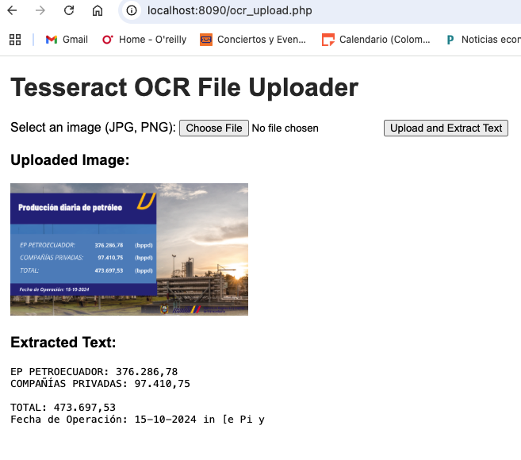
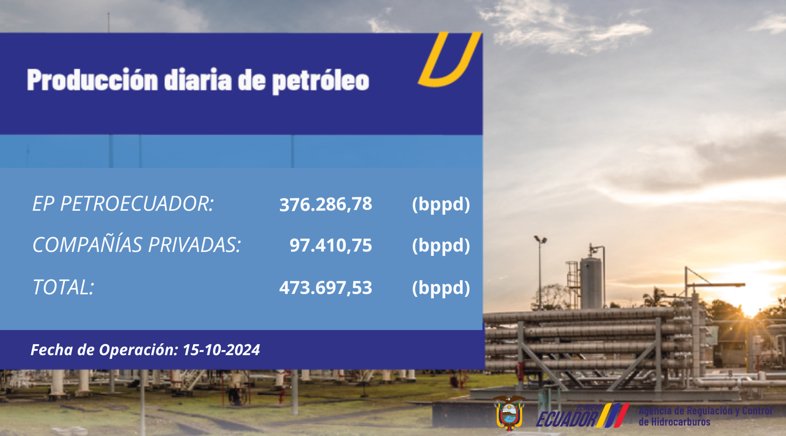

# ocr_php_tesseract

This is an OCR application built with the following tecnologies:
- PHP 8.2
- thiagoalessio/tesseract_ocr 2.13.0 A wrapper to work with Tesseract OCR inside PHP.
- Imagick 3.7.0.

The application shows a file uploader that allows the user to select an image, after pressing the button Upload and Extract text, the extracted text will shown in below.

We use the OCR tesseract library to extract the text and we use Imagick to manipulate the image, so it's easier to extract the text.

The image we used for testing the application was the following: 
